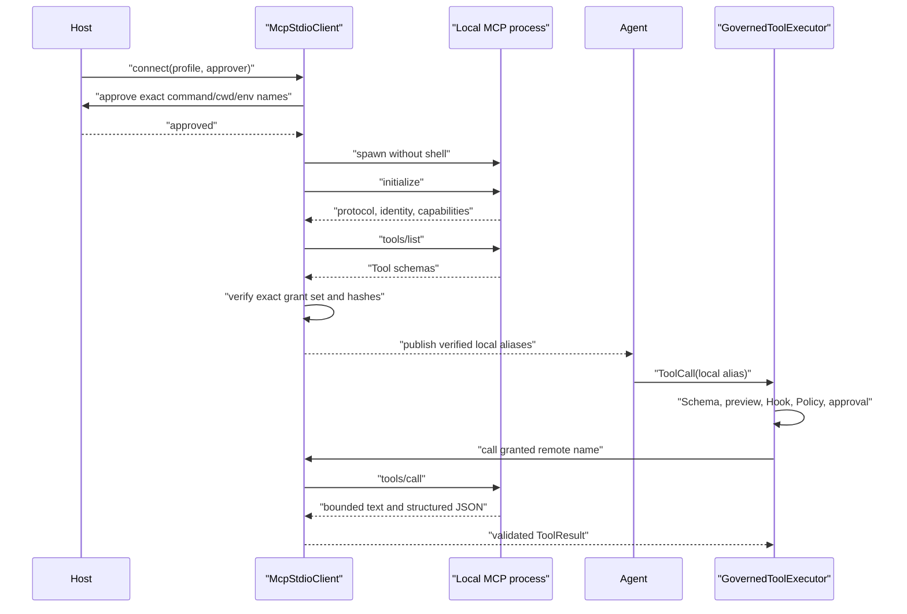

# 受治理 MCP Stdio

[English](governed-mcp.md) | [简体中文](governed-mcp.zh-CN.md)

## 目的

M5b 连接经过明确批准的本地 MCP Server，但不允许 MCP Discovery 自动创造 Agent Authority。
本版本只支持 Direct Local `stdio` Transport 和 MCP Tools。

实现使用官方稳定 Python SDK `mcp>=1.28.1,<2` 与 Protocol `2025-11-25`。Streamable HTTP、
SSE、OAuth、Resources、Prompts、Roots、Sampling、Elicitation、Tasks、Server Instructions、
Dynamic Tool Refresh、Automatic Retry 和 Package Installation 不在本版本范围。

## 两次权限决策

启动 MCP Server 与调用其中一个 Tool 是两次不同决策：

1. **Connection Approval**：允许一组精确 Local Executable/argv/cwd/Environment Name
   以 Agent User OS Privilege 启动。
2. **Tool Governance**：将一个已校验 `ToolCall` 继续送入 ActionPreview、Hook、Policy
   和可选 Tool Approval。

Connection Approval 从不代表全部 ToolCall 都获得批准。



## Host-pinned Profile

`McpServerProfile` 是可信 Composition Data，绝不从 Repository、Skill、Model Response、
Server Response、Registry 或 Discovered Configuration File 中加载。

Profile 固定：

- 稳定 `server_id`；
- 已存在的 Absolute Regular-file Executable Path；
- 精确 Argument Tuple；
- 已存在且未链接的 Absolute Working Directory；
- 最多 32 个显式 Environment Key 及 `SecretStr` Value；
- 精确 Protocol、Server Name 和 Server Version；
- 1 到 32 个 `McpToolGrant`；
- Startup、Listing、Call、Close、Schema、Tool Count、Text、JSON 与 Result Limit。

Executable 与 cwd 在 Model Construction 时检查，并在 Process Creation 前重新验证。Link、
Windows Reparse Point、Relative/Missing Path、Non-regular/Non-executable File 都 Fail Closed。
Argument Token 作为数据传递，不使用 Command String、Shell Expansion、PATH Resolution
或 URL Opener。

POSIX Virtual Environment 的 `sys.executable` 可能是 Symlink。应优先使用已审查、已安装、
没有 Link 的 MCP Console Entry Point。不要盲目 Resolve venv Python Symlink，否则可能
切换到 Base Interpreter、改变 `sys.prefix` 并丢失 venv Package。

Environment Value 保持 `SecretStr`，Approval 只展示排序后的 Key Name。官方 SDK 只添加
小型 Platform-default Environment Allowlist 和显式 Profile Value。

## 精确 Tool Contract

每个 `McpToolGrant` 绑定：

- 精确且区分大小写的 Remote Name；
- 有界 Local Agent Alias；
- Host-owned Model-facing Description；
- Host-owned `SideEffect` 与 `RiskLevel`；
- Canonical Input-schema SHA-256；
- 可选 Canonical Output-schema SHA-256。

Server Title、Description、Icon、Annotation、Metadata、Instruction 和 Destructive/Read-only
Hint 全部忽略，不能改变 Policy Authority 或 Model-facing Definition。

Initialization 后要求 Protocol/Identity 精确匹配、存在 Tools Capability、
`tools.listChanged` 关闭、Tool List 单页且不分页、Observed Name 唯一、Observed/Granted
Name 完全相等、JSON Schema 合法且 Hash 匹配、没有 Task-required Tool。

Missing、Unexpected、Duplicate、Renamed、Paginated 或 Drifted Tool 会拒绝整个 Connection，
不会发布 Partial Registry。Canonical Hash 使用 Sorted-key Compact ASCII JSON，并拒绝
Non-finite Number。Hash 只证明 Contract 相等，不证明 Code Provenance 或 Safe Behavior。

## SDK 与进程生命周期

Production `OfficialStdioSessionFactory` 把 `stdio_client` 和 `ClientSession` 放在专用
Asyncio Owner Worker 中，因为 SDK AnyIO Context 必须由进入它的 Task 退出。Public Call
可以来自其他 Task；`aclose()` 通知 Worker，由 Owner Task 完成 Protocol Shutdown 和
Process-tree Cleanup。

```text
new -> approving -> connecting -> verifying -> ready -> closing -> closed
                         \---------- failure ----------/
```

`McpStdioClient` 只能使用一次。Call 串行且不 Retry；Startup、Initialize、Listing、Call、
Close 各有 Deadline。Timeout、Cancellation 或 Raw Transport Failure 会关闭 Session，
后续 Call 不可用。

Read-only Timeout 返回 `mcp_tool_timeout`。WRITE、EXECUTE 或 NETWORK Timeout 返回
`mcp_tool_completion_unknown`：停止等待无法证明 Remote Side Effect 没有发生。

Server stderr 发送到 `os.devnull`，避免无界 Log Capture 和 Secret Propagation，但会降低
诊断能力。

## Result 边界

SDK Adapter 只接受 Ordered Text Block、可选 Object-shaped `structuredContent` 和 `isError`。
Image、Audio、Resource Link、Embedded Resource 与 Unknown Content 会拒绝整个 Result。
Annotation 与 `_meta` 不保留。

`McpTool` 继续限制 Block Count、Aggregate Text Character、Total UTF-8 Byte、JSON Depth/
Node Count、String/Key Bound、Finite Number，以及 Success Result 的 Granted Output Schema。
Remote Business Error 保留有界 Text 与 `is_error=true`，让模型修正参数。Oversized 或
Unsupported Data 绝不会被截断成成功。

最终 Model-visible Shape 是确定性的：

```json
{
  "content_type": "mcp_tool_result",
  "server_id": "local-git",
  "structured_content": {"clean": true},
  "text": ["clean"],
  "tool": "status"
}
```

## 治理组合

```python
from mini_code_agent.mcp import McpStdioClient, build_mcp_tools
from mini_code_agent.policy import GovernedToolExecutor, TrustSource
from mini_code_agent.tools import ToolRegistry

async with McpStdioClient(profile, approver=connection_approver) as client:
    mcp_tools = build_mcp_tools(client)
    all_tools = (*native_tools, *mcp_tools)
    executor = GovernedToolExecutor(
        ToolRegistry(all_tools),
        policy=policy,
        approval=tool_approval,
        session_mode=session_mode,
        trust_source=TrustSource.MODEL,
        trust_sources={
            tool.definition.name: TrustSource.EXTENSION
            for tool in mcp_tools
        },
    )
    result = await agent_runtime(provider, executor).run(
        user_prompt="Inspect the project."
    )
```

Per-tool Provenance 在 Executor Construction 时复制。Unknown Mapping Key 和 Non-enum
Value 被拒绝。MCP ActionPreview Resource 使用
`mcp://<server_id>/tools/<remote_name>` 及 Host-selected Risk/Side Effect。

## 失败矩阵

| 边界 | 失败 | 公开结果 |
|---|---|---|
| Approval | Deny、Timeout、Exception、Malformed Result | 零进程；`connection_not_approved` |
| Launch Path | Relative、Missing、Linked、Reparse、Replaced | 零进程；`connection_failed` |
| Initialize | Timeout、Protocol/Identity Mismatch、No Tools | Close；Typed Connection Error |
| Tool List | Pagination、Dynamic Flag、Extra/Missing/Duplicate Tool | Close；零 Definition |
| Schema | Invalid、Oversized、Hash Drift | Close；零 Definition |
| Policy | Deny 或 Ask Rejected | 零 Remote Call；`permission_denied` |
| Remote Call | Timeout/Transport Failure | Close；Timeout 或 Completion Unknown |
| Result | Unsupported、Invalid、Oversized、Schema Mismatch | 静态 Tool Error；零 Partial Content |
| Close | Budget 或 SDK Failure | `close_failed`；Client 不可再用 |

## 运行验证

真实 Integration Fixture 使用官方 Low-level SDK over stdio，验证精确 Handshake、Identity、
Schema、Call、Structured Output 与 Shutdown；Connection Approval 不暴露 Environment Value；
`TrustSource.EXTENSION` Policy Deny 会阻止 Remote Call；Tool ASK 独立于 Connection Approval；
Extra Tool 或 Changed Schema 不发布任何 Definition；官方 Session 可以从另一个 Caller Task
关闭且不泄漏 Windows Transport。

## 威胁边界与非承诺

- MCP 是互操作协议，不是 Sandbox 或 Trust Protocol。
- Local Server 在 ToolCall 前的 Startup 阶段就可以执行任意代码。
- `stdio` 只限制协议经过 Child Pipe，不限制 Child 的 Filesystem、Network、Process 或 Credential Access。
- Approval 展示 Launch Fact，不会让 Executable 自动变安全。
- Host `READ_ONLY` 是 Intended Behavior Assertion，不是 Server 内部 Enforcement。
- Schema Hash 检测 Contract Drift，不检测 Implementation Drift、Package Substitution 或同 Schema 下恶意行为。
- Path Revalidation 只能缩小普通 TOCTOU，无法在所有 OS 上使 Process Launch 与 File Identity 原子绑定。
- Timeout 与 Process Cleanup 无法回滚 Side Effect。
- M5b 不验证 Executable Signature 或 Argument-file Hash，也不安装 Package。
- M5b 不实现 Remote MCP、OAuth、Resources、Prompts、Roots、Sampling、Elicitation、Tasks、
  Dynamic Update、Retry、Durable MCP Audit 或 OS Isolation。

实现与官方 [MCP Lifecycle](https://modelcontextprotocol.io/specification/2025-11-25/basic/lifecycle)、
[MCP Tools](https://modelcontextprotocol.io/specification/2025-11-25/server/tools)、
[Security Guidance](https://modelcontextprotocol.io/docs/tutorials/security/security_best_practices)
及 [Python SDK v1 Client](https://github.com/modelcontextprotocol/python-sdk/blob/v1.x/docs/client.md)
保持一致。
