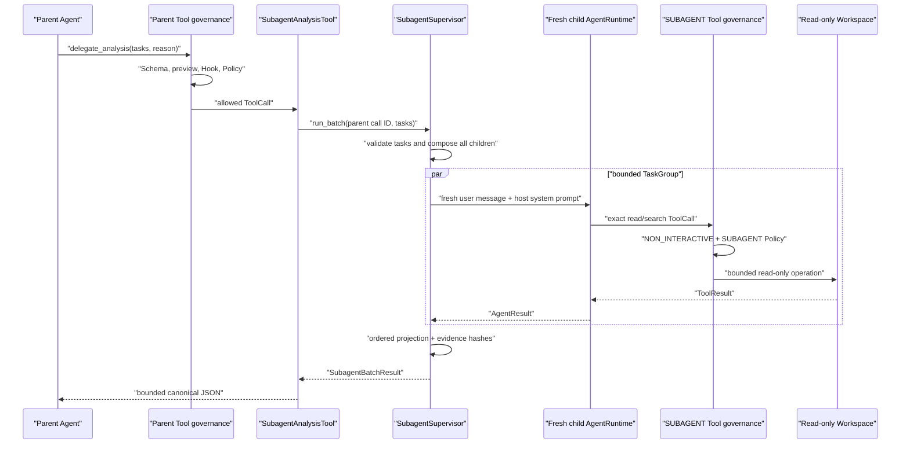

# Governed Analysis Subagents

[English](governed-subagents.md) | [简体中文](governed-subagents.zh-CN.md)

## Purpose and Scope

M6a lets one parent Agent delegate one to four independent analysis tasks without giving child
Agents new authority. It adds bounded concurrency and context isolation while preserving the
existing Tool governance boundary.

M6a supports only:

- host-created immutable analysis profiles;
- fresh in-process child `AgentRuntime` instances;
- exact read-only child Tool sets;
- `TrustSource.SUBAGENT` provenance;
- one governed parent Tool per profile;
- structured fan-out/fan-in with per-child and outer batch deadlines;
- bounded summaries, hashed Tool-result evidence, and metadata-only lifecycle events.

M6a does not create Git Worktrees and does not permit child writes, command execution, network
Tools, nested delegation, background approval prompts, durable child checkpoints, or autonomous
merging. Those are separate designs, not hidden capabilities.

## Authority and Data Flow

The trusted host owns the profile, factories, workspace root, Provider selection, Tool
composition, limits, and event sink. The parent model supplies only task text and a bounded
reason. Repository content, parent/child model output, Tool arguments, Tool results, and child
summaries remain untrusted.



The parent Tool is declared `READ_ONLY` because admitted child capabilities cannot mutate the
Workspace or invoke execute/network Tools. Its preview is `MEDIUM` risk and exposes only the
profile, task count, reason, and resource `"."`; it does not copy the task array into the
preview.

The parent Tool normally enters `GovernedToolExecutor` with `TrustSource.MODEL`. Child Tools use a
separate executor whose default provenance is `TrustSource.SUBAGENT`. A Policy can therefore
allow ordinary model reads while applying a different rule to delegated reads.

## Host Profile

`SubagentProfile` is immutable trusted composition data. It contains:

- `profile_id`: stable host identity;
- `local_name`: the parent Agent Tool name;
- `description`: host-authored model-facing description;
- `system_prompt`: child-only host instructions;
- `tool_names`: exact ordered child Tool names;
- `AgentLimits`: child turns, ToolCalls, and Provider/Tool deadlines;
- `SubagentLimits`: batch size, concurrency, task/result/evidence budgets, and deadlines.

Profiles reject duplicate Tool names, their own local delegation name, every child name beginning
with `delegate_`, Agent limits above the M6a ceiling, and configurations that cannot retain one
evidence item per possible ToolCall.

Hard ceilings are:

| Resource | Ceiling |
|---|---:|
| Tasks per batch | 4 |
| Concurrent children | 4 |
| Task characters | 20,000 |
| Child turns | 32 |
| Child ToolCalls | 128 |
| Child timeout | 600 seconds |
| Batch timeout | 900 seconds |
| Summary characters | 32,000 |
| Evidence items | 256 |
| Parent ToolResult | 1 MiB |

The batch deadline cannot be lower than the child deadline. A host can select lower values for a
specific profile.

## Composition Before Execution

`SubagentSupervisor` receives two host factories:

```python
class SubagentProviderFactory(Protocol):
    def create(
        self,
        profile: SubagentProfile,
        child_id: str,
    ) -> ModelProvider: ...


class SubagentToolFactory(Protocol):
    def create(
        self,
        profile: SubagentProfile,
        workspace_root: Path,
    ) -> ToolExecutor: ...
```

Before any child Provider request, the supervisor:

1. validates the parent ToolCall ID and the complete task tuple;
2. rejects empty, duplicate, NUL-containing, excessive, or oversized tasks;
3. generates the complete child-ID tuple and rejects malformed or duplicate IDs;
4. creates a distinct Provider and Tool executor for every child;
5. rejects reused Provider or executor object identity;
6. requires exact ordered Tool names;
7. requires every child definition to be `READ_ONLY`;
8. requires `governance_enforced is True`;
9. requires `trust_source_for(name) is TrustSource.SUBAGENT`;
10. constructs one independent `AgentRuntime` per child.

Any mismatch raises one static `SubagentCompositionError`. Raw factory exceptions and capability
details are not returned to the parent model.

`build_subagent_tools()` also rejects duplicate profile IDs, duplicate parent local names, and any
parent local name that appears in any child Tool set. This prevents a child capability graph from
containing a route back into delegation even when multiple profiles are composed together.

## Fresh Context, Not Forked Context

Each child starts with exactly:

- the host profile's `system_prompt`;
- one fresh `Message.user_text(task)`;
- the exact child Tool definitions.

It does not receive the parent transcript, parent system prompt, sibling tasks, sibling messages,
parent Tool results, or another child's context. This reduces accidental context sharing and
makes child evidence attributable to one task.

Fresh context is isolation of Agent messages, not confidentiality from the Provider or operating
system. A child can still read every file its admitted Tools allow, and an in-process Provider or
Tool implementation has the Python process's authority.

## Structured Concurrency

One outer `asyncio.TaskGroup` owns every child task. A semaphore limits active child execution to
`max_concurrency`, and one ordinal result slot preserves input order even when completion order
differs.

Each child uses `asyncio.timeout(child_timeout_seconds)`. Ordinary timeout or projection failure
becomes that child's typed result so siblings continue. One outer
`asyncio.timeout(batch_timeout_seconds)` cancels unfinished TaskGroup members and fills every
unfinished ordinal with `BATCH_TIMED_OUT`.

External cancellation is different from a deadline:

- `CancelledError` is explicitly re-raised by the child runner and parent Tool;
- TaskGroup cancels and joins all children before control returns;
- no detached `create_task`, daemon thread, process, or orphan Agent survives the parent ToolCall.

The implementation does not use `asyncio.gather(..., return_exceptions=True)` because that makes
task ownership and cancellation failure modes easier to obscure.

## Results and Evidence

`SubagentChildResult` contains bounded typed metadata:

- child ID, ordinal, profile, status, and stop reason;
- turns, ToolCall count, and token usage;
- `untrusted_summary`;
- zero or more `SubagentEvidenceItem` records;
- a static error code/message for timeout or failure;
- a canonical result SHA-256.

The summary is the child's final model text, truncated to the profile character budget and
explicitly labelled untrusted. It can contain mistakes or prompt injection and must not be treated
as authorization or test evidence.

For every completed ToolCall, evidence retains only:

- ToolCall ID and Tool name;
- error flag;
- result character count;
- SHA-256 of the UTF-8 ToolResult content.

Evidence extraction validates call/result correlation, uniqueness, completeness, and count
against the Agent result. It never retains Tool arguments or raw ToolResult content. A hash proves
that two observed byte strings are equal; it does not prove that the content is true, safe,
authentic, or confidential.

`SubagentBatchResult` preserves child ordinal order, validates profile/ID/count consistency, and
hashes a canonical ASCII JSON projection. `SubagentAnalysisTool` revalidates the returned model,
adds `content_type: "subagent_batch_result"`, serializes sorted compact ASCII JSON with
non-finite numbers disabled, and enforces the UTF-8 byte budget before returning to the parent.

No token-saving percentage is claimed. A fresh child can reduce parent transcript pressure for
some workloads, but it also adds Provider calls, Tool calls, latency, and result summaries.
Benchmarking requires a fixed task corpus and Provider-specific token accounting.

## Metadata-Only Events

The supervisor emits best-effort:

- `SubagentBatchStarted`;
- `SubagentStarted`;
- `SubagentCompleted`;
- `SubagentBatchCompleted`.

Events include bounded IDs, profile, ordinal, status, duration, counts, usage, and result hashes.
They exclude task text, reason, system prompt, summary, messages, Tool arguments, ToolResult
content, repository text, and exception text. Sink exceptions do not change execution.

These events are not added to the existing durable Agent journal because the parent
`ToolExecutor` contract does not carry parent run/turn context. M6a therefore does not claim
durable parent-child trace linkage.

## Failure Matrix

| Boundary | Failure | Public outcome |
|---|---|---|
| Parent Registry | unknown Tool or invalid JSON arguments | static Tool error; no supervisor call |
| Parent Policy | deny or non-interactive ask | `permission_denied`; no child composition |
| Batch validation | empty, duplicate, excessive, oversized, or NUL task | `invalid_batch` |
| Child IDs | malformed or duplicate host ID | static composition failure; no Provider request |
| Provider/Tool factory | exception, reused object, invalid protocol | static composition failure |
| Child capability | missing/extra/reordered/non-read-only/non-SUBAGENT Tool | static composition failure |
| Child run | non-completed stop reason | ordered `stopped` child result |
| Child deadline | timeout | ordered `timed_out` child result; siblings continue |
| Child projection | malformed result/evidence/summary | ordered `failed` child result |
| Batch deadline | unfinished children | ordered `batch_timed_out` results |
| Parent cancellation | caller cancellation | cancel/join children and re-raise |
| Result serialization | malformed or above byte budget | static failed/too-large Tool error |
| Event sink | ordinary exception | ignored; result is unchanged |

## Operational Verification

The real integration test uses:

- a parent `AgentRuntime`;
- a governed `delegate_analysis` Tool;
- two child `AgentRuntime` instances;
- real governed `ReadFileTool` and `SearchTextTool`;
- one shared read-only Workspace;
- scripted, credential-free Providers.

It proves fresh child contexts, distinct run IDs, exact child definitions, SUBAGENT provenance,
real read/search evidence hashes, ordered parent JSON, event omission, and byte-identical
Workspace state. Additional cases prove parent Policy deny causes zero factory calls, a child
cannot call the parent delegation Tool, one child timeout does not stop its sibling, and parent
cancellation cancels both children.

## Threat Boundary and Non-Claims

- In-process children are not an OS, process, memory, credential, or network sandbox.
- Read-only Tool admission constrains calls through the executor; it cannot constrain malicious
  host-supplied Provider or Tool implementation code.
- `NON_INTERACTIVE` prevents nested approval prompts. It does not turn denied child work into
  approved work; `ASK` fails closed.
- Context isolation does not hide repository data from a child Provider after a Tool returns it.
- Timeouts stop waiting and cancel cooperative work; they do not terminate arbitrary threads or
  prove that an external Provider request had no cost.
- Evidence and result hashes are integrity fingerprints, not signatures, encryption, provenance,
  semantic validation, or durable audit.
- Best-effort events do not establish crash recovery or exactly-once execution.
- M6a does not provide Worktree isolation, child writes, stage/commit/merge, candidate adoption,
  conflict resolution, or rollback.
- M6a does not claim lower cost, lower latency, higher answer quality, or token savings without a
  reproducible benchmark.

M6b will treat write-capable implementation children as a separate authority boundary with
host-created Git Worktrees, candidate snapshots, and explicit adoption. It will not weaken the
M6a read-only profile.
