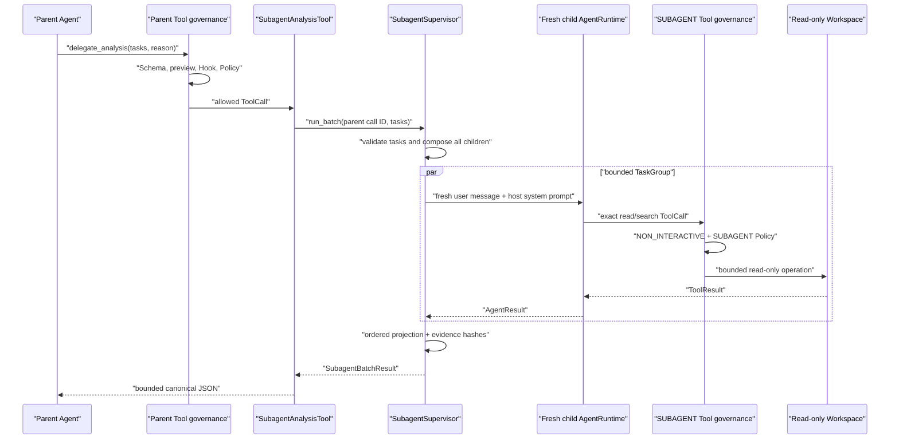

# 受治理分析 Subagent

[English](governed-subagents.md) | [简体中文](governed-subagents.zh-CN.md)

## 目的与范围

M6a 允许一个 Parent Agent 委派 1 到 4 个独立分析任务，但不授予 Child 新权限。它增加
有界并发和 Context Isolation，同时保留已有 Tool Governance Boundary。

M6a 只支持 Host-created Immutable Analysis Profile、Fresh In-process Child
`AgentRuntime`、精确只读 Child Tool Set、`TrustSource.SUBAGENT` Provenance、每个 Profile
一个受治理 Parent Tool、带 Child/Batch Deadline 的 Structured Fan-out/Fan-in，以及有界
Summary、Hashed Tool-result Evidence 和 Metadata-only Lifecycle Event。

M6a 不创建 Git Worktree，也不允许 Child Write、Command、Network Tool、Nested Delegation、
Background Approval、Durable Child Checkpoint 或 Autonomous Merge。

## 权限与数据流

可信 Host 拥有 Profile、Factory、Workspace Root、Provider Selection、Tool Composition、
Limit 和 Event Sink。Parent Model 只提供 Task Text 和有界 Reason。Repository Content、
Model Output、Tool Argument/Result 和 Child Summary 都不可信。



Parent Tool 被声明为 `READ_ONLY`，因为准入 Child Capability 不能修改 Workspace 或调用
Execute/Network Tool。Preview 为 `MEDIUM` Risk，只暴露 Profile、Task Count、Reason 和
Resource `"."`，不复制 Task Array。

Parent Tool 通常以 `TrustSource.MODEL` 进入 Executor；Child Tool 使用单独 Executor，
默认 Provenance 为 `TrustSource.SUBAGENT`，因此 Policy 可以区别普通 Model Read 和
Delegated Read。

## Host Profile

`SubagentProfile` 是不可变可信 Composition Data，包含 Profile ID、Parent Tool Local Name、
Host-authored Description、Child-only System Prompt、精确有序 Tool Name、Child `AgentLimits`
和 `SubagentLimits`。

Profile 拒绝 Duplicate Tool Name、自身 Local Delegation Name、以 `delegate_` 开头的 Child
Name、超过 M6a Ceiling 的 Agent Limit，以及无法为每个可能 ToolCall 保留一条 Evidence
的配置。

| Resource | Ceiling |
|---|---:|
| 每批 Task | 4 |
| Concurrent Child | 4 |
| Task Character | 20,000 |
| Child Turn | 32 |
| Child ToolCall | 128 |
| Child Timeout | 600 秒 |
| Batch Timeout | 900 秒 |
| Summary Character | 32,000 |
| Evidence Item | 256 |
| Parent ToolResult | 1 MiB |

Batch Deadline 不能小于 Child Deadline；Host 可以为具体 Profile 设置更低值。

## 执行前组合

`SubagentSupervisor` 接受两个 Host Factory：

```python
class SubagentProviderFactory(Protocol):
    def create(
        self,
        profile: SubagentProfile,
        child_id: str,
    ) -> ModelProvider: ...


class SubagentToolFactory(Protocol):
    def create(
        self,
        profile: SubagentProfile,
        workspace_root: Path,
    ) -> ToolExecutor: ...
```

第一次 Child Provider Request 前，Supervisor 校验完整 Task Tuple 与 Parent ToolCall ID；
拒绝 Empty/Duplicate/NUL/Oversized Task；生成并验证完整 Child ID；为每个 Child 创建不同
Provider 与 Executor；拒绝 Object Identity Reuse；要求 Tool Name 精确有序、全部
`READ_ONLY`、`governance_enforced is True`，且每个 Tool Provenance 为
`TrustSource.SUBAGENT`；随后才构造独立 `AgentRuntime`。

任意不匹配产生一个静态 `SubagentCompositionError`。Raw Factory Exception 和 Capability
Detail 不返回 Parent。`build_subagent_tools()` 还拒绝 Duplicate Profile ID、Duplicate
Parent Local Name，以及出现在任意 Child Tool Set 中的 Parent Name，阻止 Child Capability
Graph 回到 Delegation。

## Fresh Context，而不是 Forked Context

每个 Child 只从 Host Profile `system_prompt`、一条 Fresh `Message.user_text(task)` 和精确
Child Tool Definition 开始。它不接收 Parent Transcript/System Prompt、Sibling Task/
Message、Parent ToolResult 或其他 Child Context。

这只是 Agent Message Isolation，不是对 Provider 或 OS 的 Confidentiality。Child 仍可
读取其 Tool 允许的文件；In-process Provider/Tool Implementation 拥有 Python Process Authority。

## Structured Concurrency

一个外层 `asyncio.TaskGroup` 拥有全部 Child Task。Semaphore 把 Active Child 限制在
`max_concurrency`；Ordinal Result Slot 在 Completion 乱序时仍保留 Input Order。

每个 Child 使用 `asyncio.timeout(child_timeout_seconds)`。普通 Timeout 或 Projection
Failure 转为该 Child Typed Result，Sibling 继续。外层 Batch Timeout 取消未完成 TaskGroup
Member，并把所有未完成 Ordinal 填充为 `BATCH_TIMED_OUT`。

External Cancellation 与 Deadline 不同：`CancelledError` 会重新抛出；TaskGroup 会在返回
前取消并 Join 全部 Child；不存在 Detached `create_task`、Daemon Thread、Process 或
Orphan Agent。实现不使用 `asyncio.gather(..., return_exceptions=True)`，避免掩盖 Task
Ownership 与 Cancellation Failure。

## Result 与 Evidence

`SubagentChildResult` 包含 Child ID、Ordinal、Profile、Status、Stop Reason、Turn、ToolCall
Count、Token Usage、`untrusted_summary`、零到多个 `SubagentEvidenceItem`、静态 Timeout/
Failure Code 与 Canonical Result SHA-256。

Summary 是 Child 最终 Model Text，按 Profile Character Budget 截断并明确标记不可信。
它可能错误或包含 Prompt Injection，不能当作 Authorization 或 Test Evidence。

每个 Completed ToolCall 的 Evidence 只保留 ToolCall ID/Name、Error Flag、Result Character
Count 和 ToolResult UTF-8 SHA-256。Extraction 校验 Call/Result Correlation、Uniqueness、
Completeness 和 Count，不保留 Tool Argument 或 Raw ToolResult。Hash 只证明 Byte 相等，
不证明内容真实、安全、Authentic 或 Confidential。

`SubagentBatchResult` 保留 Child Ordinal Order，校验 Profile/ID/Count 一致性并 Hash
Canonical ASCII JSON Projection。Parent Tool 再次校验 Result Model、添加
`content_type: "subagent_batch_result"`，使用 Sorted Compact ASCII JSON 序列化，并执行
UTF-8 Byte Budget。

项目不声称 Token 节省比例。Fresh Child 可能降低 Parent Transcript Pressure，也会增加
Provider/Tool Call、Latency 和 Summary；需要固定 Corpus 与 Provider-specific Accounting
才能 Benchmark。

## 仅 Metadata Event

Supervisor Best-effort 发出 `SubagentBatchStarted`、`SubagentStarted`、
`SubagentCompleted` 和 `SubagentBatchCompleted`。Event 仅含有界 ID、Profile、Ordinal、
Status、Duration、Count、Usage 与 Result Hash，不含 Task、Reason、System Prompt、Summary、
Message、Tool Argument/Result、Repository Text 或 Exception Text。

Event 不进入现有 Durable Agent Journal，因为 Parent `ToolExecutor` Contract 没有 Parent
Run/Turn Context，因此 M6a 不声称 Durable Parent-child Trace Linkage。

## 失败矩阵

| 边界 | 失败 | 公开结果 |
|---|---|---|
| Parent Registry | Unknown Tool/Invalid JSON | 静态 Tool Error；零 Supervisor Call |
| Parent Policy | Deny/Non-interactive Ask | `permission_denied`；零 Child Composition |
| Batch Validation | Empty/Duplicate/Excessive/Oversized/NUL Task | `invalid_batch` |
| Child ID | Malformed/Duplicate Host ID | 静态 Composition Failure；零 Provider Request |
| Factory | Exception、Reused Object、Invalid Protocol | 静态 Composition Failure |
| Child Capability | Missing/Extra/Reordered/Non-read-only/Non-SUBAGENT | 静态 Composition Failure |
| Child Run | Non-completed Stop Reason | Ordered `stopped` Child Result |
| Child Deadline | Timeout | Ordered `timed_out`；Sibling 继续 |
| Child Projection | Malformed Result/Evidence/Summary | Ordered `failed` |
| Batch Deadline | Unfinished Child | Ordered `batch_timed_out` |
| Parent Cancellation | Caller Cancellation | Cancel/Join Child 并重新抛出 |
| Result Serialization | Malformed/Oversized | 静态 Failed/Too-large Tool Error |
| Event Sink | Ordinary Exception | 忽略；Result 不变 |

## 运行验证

真实 Integration Test 使用 Parent Agent、受治理 `delegate_analysis`、两个 Child Agent、
真实 Governed Read/Search、共享只读 Workspace 和无凭证 Scripted Provider，证明 Fresh
Context、Distinct Run ID、Exact Definition、SUBAGENT Provenance、Read/Search Evidence
Hash、Ordered Parent JSON、Event Omission 和 Workspace Byte 不变。

附加 Case 证明 Parent Policy Deny 时零 Factory Call；Child 不能调用 Parent Delegation；
单 Child Timeout 不停止 Sibling；Parent Cancellation 会取消两个 Child。

## 威胁边界与非承诺

- In-process Child 不是 OS、Process、Memory、Credential 或 Network Sandbox。
- Read-only Tool Admission 只约束经过 Executor 的调用，不能约束恶意 Host Provider/Tool Code。
- `NON_INTERACTIVE` 阻止 Nested Approval；`ASK` Fail Closed，不会自动变成 Approved。
- Context Isolation 不会在 Tool 返回后向 Child Provider 隐藏 Repository Data。
- Timeout 只停止等待并取消 Cooperative Work，不终止任意 Thread，也不能证明外部请求没有成本。
- Evidence/Result Hash 是 Fingerprint，不是 Signature、Encryption、Provenance、Semantic Validation 或 Durable Audit。
- Best-effort Event 不建立 Crash Recovery 或 Exactly-once。
- M6a 不提供 Worktree、Child Write、Stage/Commit/Merge、Candidate Adoption、Conflict Resolution 或 Rollback。
- 没有可复现 Benchmark 时，不声称 Lower Cost/Latency、Higher Quality 或 Token Saving。

M6b 将 Write-capable Implementation Child 作为单独 Authority Boundary，通过 Host-created
Git Worktree、Candidate Snapshot 和 Explicit Adoption 实现，不削弱 M6a Read-only Profile。
