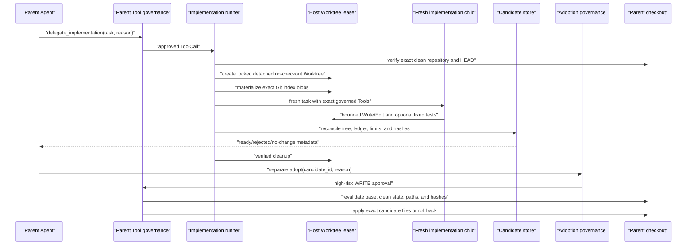
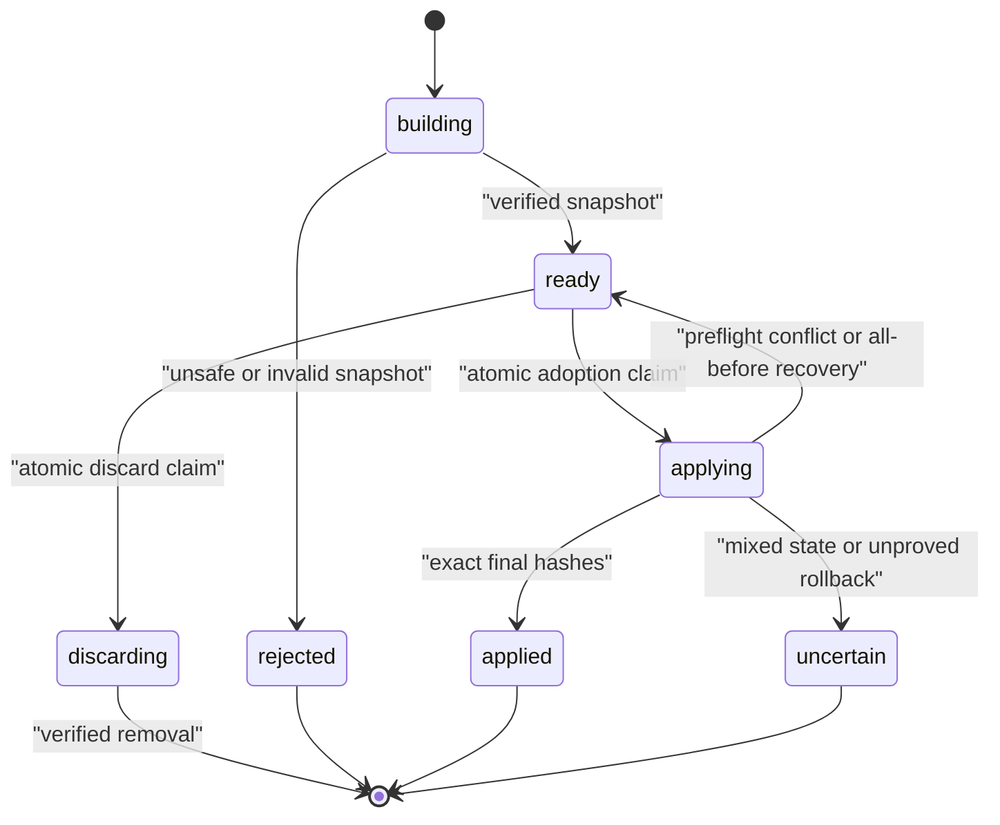

# 受治理 Worktree 候选

[English](governed-worktree-candidates.md) | [简体中文](governed-worktree-candidates.zh-CN.md)

## 目的与范围

M6b 允许 Parent Agent 委派一个有界实现任务，但不让 Child 写入 Parent Checkout。Host
从精确 Clean Base 创建 Locked Git Worktree Lease，在 Lease 中运行一个 Implementation
Subagent，独立验证并持久化 Candidate，移除 Lease，再把 Adoption 作为单独的高风险
WRITE Tool 暴露。

首版支持单 Child、Host-pinned Repository/State Root/Git/Path Prefix/Profile/Limit、
Regular UTF-8 `100644`/`100755` 文件的 Add/Modify、可选 Host-fixed `run_tests`、
Content-addressed Candidate Blob、Immutable Manifest，以及 Verified Ready Candidate 的
Explicit Adopt/Discard。

不支持 Delete、Rename、Arbitrary Command/Git/MCP/Network、Recursive Delegation、
Stage/Commit/Merge/Push、Automatic Adoption 或编辑 Dirty Parent。

## 权限与数据流

可信 Host 拥有 `WorktreeProfile`、Factory、State Storage、Git Executable、Policy、Approval
和全部 Hard Limit。Parent Model 只提供 `task` 与 `reason`。Child 无法选择 Repository、
Capability、Test Command、Candidate Path 或 Adoption Policy。



Child Completion 与 Parent Adoption 有意拆成两个权限决策。Child 可以产生“存在改动”的
Evidence，但不能授权改动进入 User Checkout。

## Host Profile 与限制

`WorktreeProfile` 是 Immutable Composition Data，要求 Repository、State Root 和 Git
Executable 都是 Absolute、Existing、Unlinked Path；State Root 不能与 Repository 重叠；
Allowed Path Prefix 会 Normalize 并按 Case-insensitive Uniqueness 校验；内嵌
`SubagentProfile` 必须使用 Implementation Mode。

| Resource | 默认值 | Hard Model Ceiling |
|---|---:|---:|
| Active Lease | 2 | 4 |
| Tracked Base File | 10,000 | 20,000 |
| Tracked Base Byte | 256 MiB | 1 GiB |
| Tracked Path Depth | 32 | 64 |
| Candidate File | 32 | 128 |
| Candidate After-content | 2 MiB | 16 MiB |
| 单 Candidate File | 1 MiB | 8 MiB |
| Relative Path | 1,024 字符 | 1,024 字符 |
| Returned Diff | 32 KiB | 64 KiB |
| Cleanup Deadline | 30 秒 | 300 秒 |

这些是 Admission Limit，不是 Performance Claim。

## Lease 创建与物化

`WorktreeManager` 先验证 Configured Root 是精确 Non-bare Repository，捕获 `HEAD`，要求
完全 Clean Status，读取 NUL-delimited Index Pointer，再通过 `git cat-file --batch`
读取 Raw Object，并在 Object Acquisition 后再次检查 `HEAD` 与 Status。

Host 创建：

```text
git worktree add --detach --no-checkout --lock --reason <lease-id> <path> <base>
```

文件物化不执行 Checkout Filter、Hook、Smudge Process 或 Working-tree Conversion。
`materialize_index()` 只从 Verified Object Byte 写入 Regular `100644`/`100755` Index Entry，
执行全部 Path/File/Tree Budget，拒绝 Alias/Link，并记录 Immutable Base Manifest。精确
Worktree Administrative Directory 被持久化，并在 Cleanup 时重新验证。

首版只接受 Git SHA-1 Object ID；其他 Object Format Fail Closed。

## Child Capability 与 Mutation Ledger

Child 获得 Fresh Context 和新 `AgentRuntime`。Provider I/O 前验证其精确 Tool Set：

- 必需 Read/Search/Write/Edit；
- 可选 Fixed-profile `run_tests`；
- `TrustSource.SUBAGENT` Provenance；
- 不提供 Git、Arbitrary Command、MCP、Network、Skill/Hook Registration、Delegation
  或 Parent Approval；
- `SessionMode.NON_INTERACTIVE`，任何 `ASK` Fail Closed。

`LedgerRecordingToolExecutor` 只记录 Write/Edit 成功返回的 Structured `MutationResult`。
每个 Immutable Entry 绑定 ToolCall Identity、Path、Operation、Before/After SHA-256、
Byte/Line Count 与 Predecessor Hash。Natural-language Child Output 不产生 Mutation Authority。

## 独立 Candidate Snapshot

Child 停止后，`CandidateSnapshotter` Walk 完整 Lease Tree，并与 Base Manifest、Ordered
Mutation Ledger、Allowed Path Prefix、Regular-file/Mode/UTF-8/Path/Count/Byte Limit 和
Child Status/Evidence Hash 对账。

Ready Candidate 含 Sorted Addition/Modification、Bounded Unified Diff、Before/After Hash
与 Content-addressed After-byte；Canonical Manifest SHA-256 保存于 Repository 外。
Unknown Change、Deletion、Unsupported Mode、Link、Case Alias、Ledger Mismatch、Invalid
Content 或 Budget Violation 产生 Rejected Candidate；零改动产生 `no_changes`。



## 清理与取消

Finalization 先 Snapshot 再 Cleanup。Cleanup 验证 Lease Identity、Registered Worktree Path、
Administrative Directory、Candidate Persistence，以及 Verified Candidate State 或未变化
Base Tree，然后用固定 Git argv Unlock、Remove、Prune。Unlock 后 Removal 失败会尝试 Relock，
并记录 `cleanup_required`。

External Cancellation 仍是 Cancellation。Snapshot/Cleanup 在 Shielded Bounded Finalization
Task 中运行；Timeout 记录 Cleanup-required Diagnostic。这不能使 Cleanup Crash-proof。

## Adoption、Rollback、Recovery 与 Discard

`adopt_subagent_candidate` 与 `discard_subagent_candidate` 是独立高风险 WRITE Tool。
Preview 在 Policy/Approval 前验证 Stored Manifest/Blob，并展示有界 Repository/Base/Path/
Byte/Diff Resource。

Adoption 流程：

1. 原子 Claim `ready -> applying`；
2. 要求精确 Repository、Clean Status 和 Original Base `HEAD`；
3. Preflight 每个 Destination 与 Before-hash；
4. Stage 同目录 Temporary File；
5. 第一次 Replacement 前立即重新校验全部 Path；
6. 按 Canonical Path Order Apply；
7. 验证精确 Changed Set 与 After-hash；
8. 记录 `applied`，文件保持 Unstaged/Uncommitted。

Preflight Conflict 零写入并将 Candidate 退回 `ready`。I/O Failure 逆序 Rollback；能够证明
恢复则记录 `apply_failed_rolled_back`，否则记录 `uncertain` 与 Recovery Evidence。

Interrupted `applying` 会比较 Parent File 的 Before/After Hash：All-before -> `ready`，
All-after -> `applied`，Mixed/Unknown -> `uncertain`。Discard 只允许 Verified `ready`；
Applied/Applying/Rejected/Uncertain 不会被静默删除。

## 失败矩阵

| 失败 | 公开结果 | Parent Mutation |
|---|---|---|
| Dirty/Wrong/Bare Repository | Typed Repository Error | None |
| Lease/Tree Budget Exceeded | Typed Limit/Materialization Error | None |
| Child Tool/Profile Mismatch | Provider I/O 前 Composition Failure | None |
| Child Timeout/Failure | Typed Child Result 后 Snapshot/Finalize | None |
| Unknown Tree Mutation/Ledger Mismatch | Rejected Candidate | None |
| Snapshot Persistence Failure | Cleanup Required | None |
| Cancellation | Bounded Finalization 后重新抛出 | None |
| Adoption Stale Base/Path/Hash | Conflict，Candidate 回到 Ready | None |
| Adoption I/O Failure + Proven Rollback | Rolled Back | 恢复 Before-state |
| Adoption I/O Failure + Unproved Rollback | Uncertain + Recovery Record | Unknown/Mixed |
| Cleanup Identity/Removal Failure | Cleanup Required | None |

## 运行验证

M6b 测试覆盖 Profile、Byte-safe Git、State CAS、Materialization、Ledger、Snapshot、
Finalization、Runner、Tool、Adoption、Discard、Rollback、Recovery；真实 Git Integration
覆盖 No-checkout Materialization、Child Delegation、Parent 不变、Candidate Persistence、
Adoption/Discard/Conflict/Cancellation；Adversarial Case 覆盖 Hostile Name、Case/Unicode
Alias、Link/Reparse、Path Swap、Dirty Parent、Stale Hash、Output Limit、Killed Git、
Lease Exhaustion、Candidate/Blob Tamper、Rollback Failure 和 Cleanup Race。

精确 Count、CI Run ID、Artifact Hash 与 Release Link 只在 Release Gate 后记录到
`docs/learning/progress.md`。

## 威胁边界与非承诺

- Worktree 只分离 Checkout Path，不是 Container、VM、Filesystem/Credential/Network Sandbox 或独立 OS User。
- In-process Provider/Tool 仍拥有 Agent Process Memory 与 OS Authority。
- Tool Governance 只约束经过 Executor 的 Call；恶意 Trusted Host Code 可以绕过。
- Git Clean/Hash 与即时 Revalidation 只能缩小 TOCTOU，不能阻止同权限 Process 并发修改。
- Adoption 是 Process-serialized、Rollback-aware，不是 Power-loss Atomic、Distributed 或 Database 2PC。
- SHA-256/Git Object ID 是 Equality Fingerprint，不是 Signature、Provenance、Confidentiality、Semantic Correctness 或 Test Pass Proof。
- Candidate Diff 是有界展示证据；Content-addressed Blob 才是 Adoption Source of Truth。
- Child Completion 不代表 Candidate Ready；Ready 也不代表 Approved、Correct、Compatible 或 Adopted。
- M6b 不 Commit、Merge、Push、Reset、Clean，也不覆盖 Dirty Parent。
- 没有 Benchmark 时不声称 Token、Latency、Cost、Quality 或 Throughput 改善。
